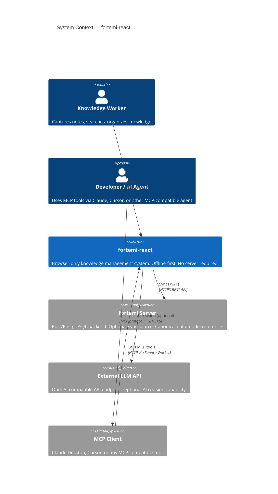
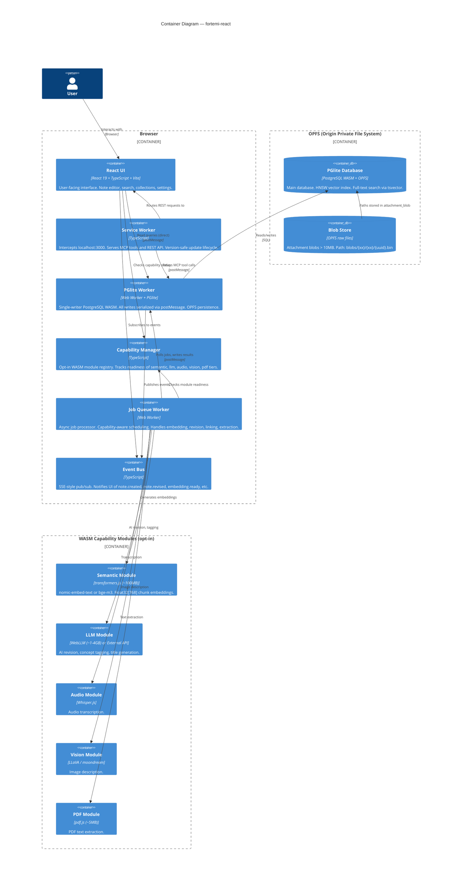

# Software Architecture Document — fortemi-react

**Version**: 2026.3.0
**Author**: roctinam
**Reviewers**: Architecture Designer (agent), Database Optimizer (agent)
**Status**: Baselined (updated for C3)
**Last Updated**: 2026-03-23

---

## 1. Introduction

### 1.1 Purpose

This Software Architecture Document (SAD) describes the architecture of fortemi-react: a browser-only reimplementation of the fortemi knowledge management system. It captures architectural decisions, component interactions, data flows, and quality attribute strategies.

### 1.2 Scope

fortemi-react runs entirely in the browser (no server required after initial load). It:
- Persists data in PGlite (PostgreSQL WASM) via OPFS
- Exposes 38 MCP tools via a Service Worker REST API
- Provides a React 19 UI for direct user interaction
- Maintains full data format parity with the Rust/PostgreSQL fortemi server

### 1.3 Monorepo Structure

The project is organized as a pnpm workspace monorepo:

| Package | Path | Purpose |
|---|---|---|
| `@fortemi/core` | `packages/core/` | Headless data layer: PGlite, repositories, migrations, workers, MCP tools, event bus, capabilities |
| `@fortemi/react` | `packages/react/` | React 19 hooks (`useNotes`, `useSearch`, etc.) and `FortemiProvider` context |
| `@fortemi/standalone` | `apps/standalone/` | Vite 7.3.1 application: UI components, pages, Service Worker registration, E2E tests |

### 1.4 References

| Document | Location |
|---|---|
| Project Intake | `.aiwg/intake/project-intake.md` |
| Data Model | `.aiwg/intake/data-model.md` |
| Architecture Diagrams | `.aiwg/intake/architecture.md` |
| Flows | `.aiwg/intake/flows.md` |
| ADR-001 PGlite | `.aiwg/adrs/ADR-001-pglite-storage-engine.md` |
| ADR-002 Capabilities | `.aiwg/adrs/ADR-002-capability-modules.md` |
| ADR-003 Single Writer | `.aiwg/adrs/ADR-003-pglite-single-writer.md` |
| ADR-004 Service Worker | `.aiwg/adrs/ADR-004-service-worker-api.md` |
| ADR-005 Compatibility | `.aiwg/adrs/ADR-005-browser-compatibility.md` |
| Supplementary Requirements | `.aiwg/requirements/supplementary-requirements.md` |

---

## 2. Architectural Constraints

The following constraints are non-negotiable (from option-matrix.md):

| Constraint | Source | Impact |
|---|---|---|
| UUIDv7 primary keys everywhere | Sync compatibility with server | All INSERT statements must generate UUIDv7 |
| Soft-delete (`deleted_at`) on all mutable entities | Sync tombstoning protocol | All DELETE operations must be `UPDATE ... SET deleted_at = now()` |
| JSON field names identical to server | Format parity | Repository layer must match server OpenAPI response shapes exactly |
| Capability module system before any WASM | No forced downloads | CapabilityManager must be initialized before transformers.js, WebLLM, or Whisper.js |
| AGPL-3.0 | License compliance | No proprietary dependencies |
| CalVer YYYY.M.PATCH no leading zeros | Server versioning match | Enforced in package.json and git tags |
| PGlite as storage engine | Schema evolution requirement | All migrations written as numbered SQL files |

---

## 3. System Context (C4 Level 1)



---

## 4. Container Architecture (C4 Level 2)



---

## 5. Layer Architecture

```
┌─────────────────────────────────────────────────────────────────┐
│                        React UI Layer                           │
│  NotesPage │ SearchPage │ CollectionsPage │ SettingsPage        │
│  NoteEditor │ SearchBar │ CapabilityBadge │ ArchiveSwitcher     │
├─────────────────────────────────────────────────────────────────┤
│                     Repository Layer                            │
│  NotesRepository │ SearchRepository │ AttachmentsRepository     │
│  CollectionsRepository │ TagsRepository │ LinksRepository       │
│  (All enforce soft-delete, UUIDv7, format parity)              │
├─────────────────────────────────────────────────────────────────┤
│                  Worker Communication Layer                     │
│  PGliteWorkerClient (type-safe postMessage API)                │
│  Message types: QUERY | EXEC | BEGIN | COMMIT | ROLLBACK       │
├─────────────────────────────────────────────────────────────────┤
│              PGlite Worker (Single Writer)                      │
│  Serialized writes │ Concurrent reads (read-only connections)   │
│  Migration runner │ HNSW index management                      │
├─────────────────────────────────────────────────────────────────┤
│                     Storage Layer                               │
│  PGlite (PostgreSQL WASM) │ OPFS persistence                   │
│  pgvector extension │ tsvector FTS │ content hashing (@noble)  │
└─────────────────────────────────────────────────────────────────┘

Transversal systems (all layers):
- Event Bus: SSE-style pub/sub across all layers
- Capability Manager: WASM module registry, readiness tracking
- Job Queue Worker: Async processing, capability-aware scheduling
- Service Worker: REST/MCP API interception layer (parallel to UI)
```

---

## 6. Key Architecture Patterns

### 6.1 PGlite Single-Writer Pattern

All write operations are serialized through a single PGlite Worker. Read-only queries may use secondary PGlite connections.

```
Repository Layer
     │
     ├─ Writes ──→ PGliteWorkerClient ──postMessage──→ PGlite Worker (single instance)
     │                                                       │
     └─ Reads ───→ PGliteWorkerClient (or direct read-only connection)
```

**Why**: PGlite's OPFS sync adapter does not support concurrent writes. Serializing through a single worker prevents write conflicts without locking primitives.

**Message Protocol**:
```typescript
type WorkerMessage =
  | { type: 'QUERY'; id: string; sql: string; params: unknown[] }
  | { type: 'EXEC'; id: string; sql: string; params: unknown[] }
  | { type: 'BEGIN'; id: string }
  | { type: 'COMMIT'; id: string }
  | { type: 'ROLLBACK'; id: string }

type WorkerResponse =
  | { type: 'RESULT'; id: string; rows: unknown[] }
  | { type: 'ERROR'; id: string; message: string }
  | { type: 'ACK'; id: string }
```

### 6.2 Service Worker API Interception

The Service Worker intercepts all `fetch()` calls to `http://localhost:3000/*` and routes them to MCP tool handlers backed by the PGlite Worker.

```
AI Agent (Claude/Cursor)
     │
     ▼
MCP Client
     │ POST http://localhost:3000/mcp
     ▼
Service Worker (intercept)
     │
     ├─ /mcp  ──→ MCPRequestRouter ──→ tool handler ──→ Repository ──→ PGliteWorker
     ├─ /api/v1/notes  ──→ REST handler ──→ Repository ──→ PGliteWorker
     └─ /api/v1/search ──→ SearchHandler ──→ PGliteWorker (FTS + vector)
```

**Version safety**: Service Worker only calls `skipWaiting()` after all in-flight requests are drained.

### 6.3 Capability Module System

No WASM beyond PGlite itself is loaded without explicit user consent.

```
User/UI ──→ CapabilityManager.enable('semantic')
                    │
                    ▼
             Checks: already loaded? → return ready
             Downloads: transformers.js + model weights (~100MB)
             Initializes: EmbeddingModule
             Registers: 'semantic' → READY
                    │
                    ▼
             Event: 'capability.ready' → { name: 'semantic' }
                    │
             Job Queue Worker picks up pending 'embedding' jobs
```

Capability tiers:
| Name | WASM | Size | Purpose |
|---|---|---|---|
| `text` | PGlite built-in | ~8MB | FTS, BM25, SQL — always on |
| `semantic` | transformers.js | ~100MB | Embeddings, vector search |
| `llm` | WebLLM or external API | 1–4GB or 0 | AI revision, tagging, titles |
| `audio` | Whisper.js | ~100MB | Audio transcription |
| `vision` | LLaVA/moondream | ~1-4GB | Image description |
| `pdf` | pdf.js | ~5MB | PDF text extraction |

### 6.4 Hybrid Search (BM25 + pgvector RRF)

```sql
-- FTS pass
SELECT note_id, ts_rank(tsv, query) AS fts_score
FROM note_revised_current
WHERE tsv @@ plainto_tsquery('english', $1)
  AND deleted_at IS NULL
ORDER BY fts_score DESC LIMIT 60;

-- Vector pass (when semantic module ready)
SELECT note_id, 1-(vector <=> $query_vector) AS vec_score
FROM embedding
ORDER BY vector <=> $query_vector LIMIT 60;

-- RRF fusion (k=60)
WITH fts AS (...), vec AS (...)
SELECT note_id,
  COALESCE(1.0/(60+fts.rank), 0) +
  COALESCE(1.0/(60+vec.rank), 0) AS rrf_score
FROM ...
ORDER BY rrf_score DESC LIMIT $limit;
```

RRF k=60 matches server implementation for result convergence.

---

## 7. Database Architecture

### 7.1 Migration Strategy

Browser migrations are numbered SQL files adapted from the server's numbered migrations:

```
migrations/
  0001_initial_schema.sql     ← CREATE TABLE note, note_original, note_revised_current, note_revision, job_queue, ...
  0002_skos_tagging.sql       ← CREATE TABLE skos_scheme, skos_concept, skos_concept_relation, note_tag, note_skos_tag
  0003_attachments.sql        ← CREATE TABLE attachment, attachment_blob, document_type
  0004_embedding_sets.sql     ← CREATE TABLE embedding, embedding_set, embedding_set_member, link
  0005_multi_archive.sql      ← CREATE TABLE collection, archive, provenance_edge, api_key
```

**Adaptation rules** (what gets changed from server migrations):
- REMOVE: `CREATE ROLE`, `GRANT`, tablespaces, publications
- REMOVE: Server-only extensions (`pg_partman`, etc.)
- KEEP: `CREATE TABLE`, `ALTER TABLE`, `CREATE INDEX`, pgvector, `tsvector GENERATED`
- ADD: HNSW index tuning for PGlite (`m=16, ef_construction=64`)

### 7.2 Schema Version Tracking

```sql
-- archive table tracks schema_version per database instance
SELECT schema_version FROM archive WHERE name = $current_archive;

-- Migration runner applies pending migrations in sequence:
FOR EACH migration N WHERE N > schema_version:
  BEGIN;
  <execute migration SQL>;
  UPDATE archive SET schema_version = N WHERE name = $archive;
  COMMIT;
```

### 7.3 HNSW Index

```sql
CREATE INDEX ON embedding USING hnsw (vector vector_cosine_ops)
WITH (m = 16, ef_construction = 64);
```

Parameters tuned for PGlite's WASM execution environment. Server uses `m=16, ef_construction=128` for higher recall; browser uses `ef_construction=64` for faster index build time.

---

## 8. Security Architecture

### 8.1 API Key Storage

API keys stored in `api_key` table with `key_hash` (never plain text). Hashed with SHA-256.

### 8.2 External LLM API Keys

External API keys (OpenAI-compatible endpoints) stored in:
1. User-configurable — entered in Settings UI
2. Stored in `localStorage` (encrypted with Web Crypto API, AES-256-GCM)
3. Never stored in PGlite (not in sync scope)

### 8.3 Content Security Policy

Service Worker and main page enforce:
```
Content-Security-Policy: default-src 'self'; script-src 'self' 'wasm-unsafe-eval'; worker-src 'self'; connect-src 'self' https:
```

`wasm-unsafe-eval` required for PGlite WASM. External API calls require `https:` in `connect-src`.

### 8.4 CORS / COOP / COEP

> **Errata (2026-03-22):** PGlite 0.4.1 uses OPFS sync access handles, NOT SharedArrayBuffer. COOP/COEP headers are **not required** by default.

Do NOT set COOP/COEP headers unless a specific feature requires them. These headers block third-party resources (fonts, CDN scripts) and are unnecessary for PGlite persistence.

---

## 9. Quality Attributes

### 9.1 Performance

| Metric | Target | Strategy |
|---|---|---|
| Note create (no AI) | < 200ms | Transaction in Worker, no network |
| FTS search (1k notes) | < 500ms | tsvector GIN index, query via Worker |
| Vector search (10k embeddings) | < 1s | HNSW index, cosine ops |
| PGlite startup (10k notes) | < 3s | Pre-warm Worker on app load |
| Embedding (per chunk) | < 2s | transformers.js WASM in Worker |

### 9.2 Reliability

| Metric | Target | Strategy |
|---|---|---|
| Data durability | No loss on browser close | OPFS sync after every transaction |
| Migration safety | Never partial apply | BEGIN/COMMIT per migration, schema_version updated atomically |
| Job idempotency | Safe to re-run | Job status tracked; completed jobs not re-run |
| SW update safety | No dropped requests | `skipWaiting` only after request drain |

### 9.3 Compatibility

> **Errata (2026-03-22):** OPFS persistent storage is Chrome-only. See ADR-005 for full browser-specific persistence matrix.

| Browser | Min Version | Persistence | Notes |
|---|---|---|---|
| Chrome / Chromium | 102+ | OPFS (`opfs-ahp://`) | Full support. Primary target. |
| Firefox | 111+ | IndexedDB (`idb://`) | OPFS AHP not supported; `idb://` adapter works |
| Safari | 17+ | In-memory only | OPFS sync access handle limit (252) below PGlite minimum (~300) |
| Mobile Safari | Out of scope v1 | None | iOS forces WebKit; OPFS unreliable |

### 9.4 Offline-First

All operations work without network access. The only network-dependent features are:
- External LLM API calls (optional capability)
- Server sync (v2+, not in v1 scope)

---

## 10. Technology Stack

> **Errata (2026-03-22):** Versions corrected per Errata #4. See also Errata #2 (hashing) and #3 (MCP SDK).

| Layer | Technology | Version | Notes |
|---|---|---|---|
| UI Framework | React | 19.x (19.2.4) | `forwardRef` deprecated; use ref callback with block body |
| Language | TypeScript | 5.x | |
| Build Tool | Vite | 7.x (7.3.1) | Vite 8 uses Rolldown — too new for v1 |
| Storage Engine | @electric-sql/pglite | **0.4.x (0.4.1)** | Breaking: default DB `template1` → `postgres`; use explicit `database: 'postgres'` |
| Vector Extension | @electric-sql/pglite/vector | 0.4.x | Bundled: `import { vector } from '@electric-sql/pglite/vector'` |
| Multi-tab | @electric-sql/pglite/worker | 0.4.x | `PGliteWorker` with built-in leader election |
| Embeddings | @huggingface/transformers | **3.x (3.8.1)** | `@xenova/transformers` is deprecated |
| LLM (in-browser) | @mlc-ai/web-llm | 0.2.x (0.2.82) | `ChatModule` → `Engine` rename in 0.2.81; WebGPU required |
| Hashing | @noble/hashes | latest | BLAKE3 (pure JS) + SHA-256 fallback. Errata #2: replaces unmaintained `blake3-wasm` |
| UUID Generation | uuid | **13.x (13.0.0)** | Native UUIDv7 since v10; standalone `uuidv7` package unnecessary |
| PDF Extraction | pdfjs-dist | 5.x (5.5.207) | `getTextContent` now async |
| Testing (unit) | Vitest | **4.x (4.1.0)** | Supports Vite 6/7/8 |
| Testing (E2E) | Playwright | 1.x (1.58.2) | |
| Linting | ESLint | **9.x (^9.0.0)** | Flat config mandatory; needs typescript-eslint v8+ |
| CI/CD | Gitea Actions | — | |
| License | AGPL-3.0 | — | |

**MCP protocol implementation:**

> **Errata #3:** The official `@modelcontextprotocol/sdk` (v1.27.1) provides only `StdioClientTransport` and `SSEClientTransport` — neither works in a Service Worker context. There is no browser transport. The MCP tool handlers (C2-13 through C2-15) must implement JSON-RPC 2.0 dispatching manually in the Service Worker. The protocol surface is small (`tools/call`, `tools/list`, `resources/*`, `prompts/*`) — manual implementation is straightforward.

**Vite configuration required for PGlite:**
```js
// vite.config.ts
{
  optimizeDeps: { exclude: ['@electric-sql/pglite'] },
  worker: { format: 'es' }
}
```

---

## 11. Architectural Risks (Residual)

After Elaboration Iteration 1 PoC:

| Risk | Residual Concern | Mitigation |
|---|---|---|
| R-001 | Safari 17 OPFS sync in practice | Tested in PoC; documented in ADR-005 |
| R-002 | Schema drift from server | Format parity test suite (ongoing) |
| R-004 | WASM download UX | Capability module system (opt-in, progress bar) |
| R-005 | OPFS storage quota | Warn at 80%; guide user to purge |

---

## 12. Open Issues (Elaboration Items)

| Issue | Target Resolution |
|---|---|
| PGlite multi-reader strategy (concurrent read-only connections) | E1 PoC |
| BLAKE3 via @noble/hashes (pure JS) with SHA-256 fallback | E1 PoC | <!-- Errata #2: blake3-wasm replaced -->
| SW update draining strategy (count in-flight requests) | E1 PoC |
| External LLM API key encryption format (Web Crypto AES-256-GCM) | E2 UC-005 |
| Multi-archive switching (archive table + PGlite instance pool) | E2 UC-007 |

---

**SAD Version History**:

| Version | Date | Author | Change |
|---|---|---|---|
| 2026.3.0 | 2026-03-21 | roctinam | Initial draft — Inception completion |
