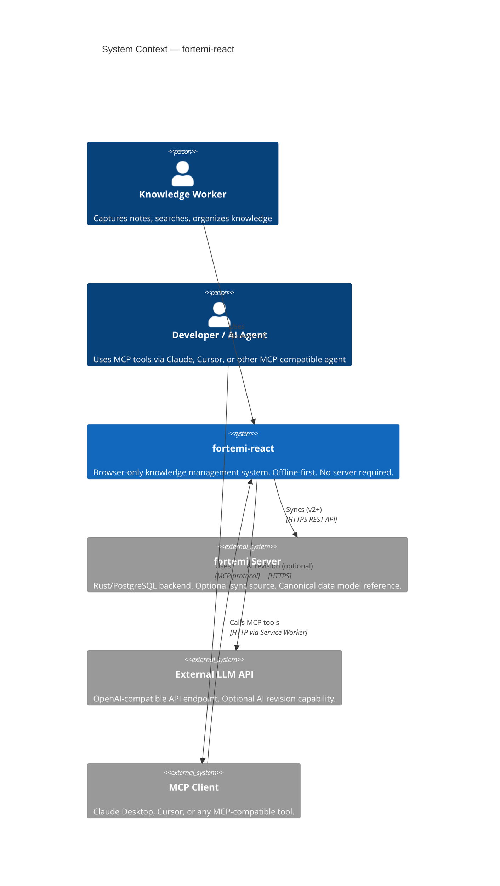
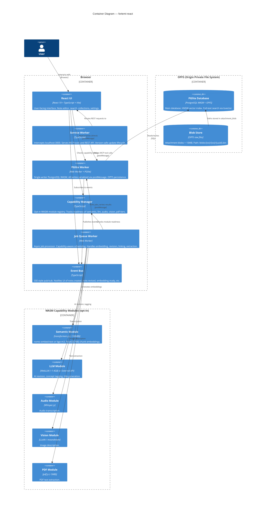

# Software Architecture Document — fortemi-react

**Version**: 2026.7.14 platform-contract amendment
**Author**: roctinam
**Reviewers**: Architecture Designer (agent), Database Optimizer (agent)
**Status**: Baselined (updated for C3)
**Last Updated**: 2026-07-29

---

## 1. Introduction

### 1.1 Purpose

This Software Architecture Document (SAD) describes the architecture of fortemi-react: a browser-only reimplementation of the fortemi knowledge management system. It captures architectural decisions, component interactions, data flows, and quality attribute strategies.

### 1.2 Scope

The #405 PGlite typed-metadata candidate is governed by ADR-016. It validates
the Fortemi-owned candidate schema before database work, uses bounded typed
author-metadata indexes with exact rechecks, and quantifies import-run clauses
over one scoped source identity before ranking. Locator source projections use
the same scope. Local tenant/archive selection is not hosted authorization.
The PGlite public adapter and tool forward the same predicates/scope before
ranking. Local candidate operation flags are separate from server negotiation;
RecordStore/static/current remote adapters reject unsupported predicates/scope
before I/O. PGlite semantic operations require an injected embedder and vector
availability. Complete citation locators, third-party adapter conformance, immutable
producer pins and released cross-runtime acceptance remain open; suite NO-GO
and all named-profile boundaries are unchanged.

The #425 scope amendment in ADR-011 governs live `2.0.0/full-v1` exports:
nonempty note selectors, rejection of combined tag/collection selectors,
embedding-only set filters, and rejection of all scoped snapshot exports.
Relationship/attachment closure is documented in the public API reference;
snapshot persistence is not a native-restore or suite portability claim.

The unreleased public #424 integration now dispatches all33 validated components
to native PGlite storage transactionally and serializes current native state.
Archive snapshots are used only by explicit archival APIs. Migration0031 retains
per-record manifest lineage, not component snapshots; scoped exports preserve
coherent lineage and reject incompatible histories with a typed loss. Native
skip follows record ownership rather than reference endpoints, and retained
embedding configs govern model/dimension projections. Required bytes, progress
callbacks and failure compensation are part of the transaction coordinator.

The required clean-installed Core package gate verifies scoped native export after
import, persisted repository CRUD, text search, backlinks and repeated transfer
into a second clean destination. It separately retains legacy null-confidence
link round trips. This does not qualify released servers or all runtime platforms;
the suite remains NO-GO and explicit archival APIs retain their own evidence.
Selected unsupported state remains fail-closed. ADR-011 defines these rules;
released producer/consumer and platform cells remain separate acceptance gates.
The native presence matrix exercises all 198 distinct component inventory fields
through validation and two clean destinations, separately from the generic
presence-store matrix. Null timestamp ranges preserve their parent value without
inventing required child-bound instances. This is an unchanged authority tuple.
Replacement retains revision/activity identities to avoid cascading away
unrelated captures' references. Omitted revisions are removed only after retained
activities are reparented. Migration0032 defers revision-number uniqueness until
commit, permitting atomic renumbering while rejecting final duplicates. Populated
upgrade, normal writers, repeated owner-child omission and late-failure rollback
are covered independently of archive-only persistence.
Community assignment replacement follows set ownership, never the referenced
note or source. Unrelated sets retain their assignments when selected notes are
replaced, selected sets move to another source, or the graph family is empty.
Producer Fortemi #1147 and consumer #424 coordinate this unchanged-wire rule.
Retained originals/history/current rows and unified provenance records update
in place, preserving external references. Omitted activities are removed after
incoming captures have moved, and retained references reject cleanup. Derivation
omissions require selected revision owners; source-note references confer no
ownership. Revision cleanup follows current/provenance apply and checks remaining
references. This adds no migration or authority tuple; alternate-key and released
cross-runtime qualification remain required.

Embedding membership omission requires both endpoint scopes: selected note and
selected set. Retained coordinates update in place, preserving composite foreign
key references. Either excluded endpoint prevents omission deletion. Shared-set
dependency declarations do not convey whole-set ownership. ADR-102/#1147 and
ADR-011/#424 coordinate this correction without changing wire/profile versions;
shared fixture publication and released-runtime qualification remain open.

Vector omission uses the same two-sided selection, with null endpoints treated
as independent. Retained vector IDs and native membership pointers survive
replacement. Coordinate cycles use transaction-local nullable staging on changed
incoming IDs, leaving native unique indexes enforced. Failed restores roll back
staging; referenced omissions reject. No schema or migration change is required.
Concurrency and released/platform matrices remain separately gated.
For note-owner changes, native membership ownership remains unchanged and only
invalid optional vector pointers detach. Virtual materializations referencing
vectors with changed note/set owners become stale so their live selectors can
reevaluate criteria. Rollback restores pointers and freshness; unchanged
imports preserve them. Producer #1147 uses the equivalent independent-note rule
for token chunk references. No native adjunct wire fields or migrations are
added. Incoming vector additions and owner changes also invalidate caches through
their typed physical source dependencies (criteria, set operation, fallback,
latest-compatible and snapshot), even when no cached member references the
incoming vector. Both old/new source sets are considered; unrelated source sets
and natively equivalent repeats preserve freshness. Native vector values and
creation-time ordering are compared using pgvector/timestamptz semantics, including
null changes without owner changes. Omission cleanup retains its two-selected-owner
predicate; DELETE RETURNING captures removed rows' source dependencies, so uncached
secondary-set omissions also invalidate dependent materializations. Referenced
deletions still reject. This conservative source-set invalidation preserves cached
membership and rolls back atomically. Public native import also compares transient
live-result fingerprints before/after mutations, using the repository resolver
for note fields, tags, collections, revisions/current metadata, attachment text,
configuration models and source ordering. Changed rows or validation errors mark
still-fresh existing caches stale; unchanged results preserve cache metadata.
Explicit resolver-domain failures are comparable outcomes; SQL failures abort.
The cost is up to two live resolutions per fresh virtual set during import.
Refresh with validation errors keeps old members and remains stale, and metadata
criteria recognize SQL NULL and JSON null as absent. Other writers, concurrency
and large-set performance remain separate work; this is not general cache
consistency proof or portable virtual-set support.

Native link, graph-edge and community-assignment replacement excludes incoming
primary keys from selected-owner omission cleanup. Retained native references
survive repeat and payload edits. Graph/set IDs remain case-sensitive, edge kind
is part of identity, and assignments move before nested-community deletion.
Referenced omissions and referenced link target-kind transitions reject and roll
back; unreferenced target-kind transitions retain their existing behavior.
These are local consumer corrections, not new schema or release qualifications.

Native public replace preserves retained SKOS child keys during cleanup rather
than deleting and recreating them. Existing field maps define the four ID-keyed
and three composite-keyed child families. Concept/note/collection ownership is
unchanged; only omitted selected-owner keys are eligible for deletion. In-place
upserts preserve native references, including insert-only note-assignment IDs.
Referenced omissions abort; repeat, payload edits, skip, late rollback and clean
re-export are covered. No portable identity or migration change is introduced;
shared publication, real/released/platform and general alternate-key evidence
remain separate gates.

#### Historical Internal Stages

The following stage records describe their original boundaries, superseded for
public dispatch by the integration above. They are not release qualification.

The first #424 implementation step exposes explicitly named archival snapshot
APIs through the public Core entry point, with pre-mutation malformed-input
reports and tuple-level conflict semantics. This does not yet repair the ordinary
full-v1 import/export dispatch: native restoration and stale-snapshot precedence
remain open acceptance gates in ADR-011. Archival byte-preservation tests remain
separate from native repository/search/traversal and post-import CRUD tests.

Migration0030 adds native core state: independent note metadata and tombstone
presence, exact timestamps, standalone declared tags, collection snapshot counts,
ordered memberships and precise link metadata/scores. Native core apply handles
the five families and attachment projections, delegating history in the same
caller-owned transaction. Attachment paths are preserved exactly as display
values; BLAKE3 remains the byte locator. Extraction edits invalidate stale
imported projections. SQL refcounts stay derived, non-authoritative data under
ADR013. Rich collection/link/tag reads and template CRUD expose native records.
Producer-fixture, ordinary mutation, byte-read, upgrade and rollback tests cover
this internal stage. They do not qualify public scoped native restore/export,
RecordStore full-v1, a published package, or a wider suite matrix cell.

Full-v1 relationship preflight now rejects inconsistent component identities,
references, revision ownership and ordering before storage access. A shared
producer-owned mutation corpus checks Rust/TypeScript agreement; this guard
does not materialize native records or resolve snapshot export precedence.

The next internal stage stores original/history/revision/current state in actual
native tables (migration0025), preserving typed fields and declaration presence.
Native readers expose restored history; repository/source/AI writes preserve
revision ordering and current pointers. This stage is not yet wired to the
public full-v1 dispatcher. All-component native apply, current-state export and
clean published producer/consumer qualification remain required by ADR-011.

Migration0026 adds native rich embedding/config/set/member storage, nullable
metadata-only vectors and precision-preserving scalar values. Dimension-scoped
queries support local 384- and producer 768-dimensional vectors; search ranks
each note by its best selected-source chunk. This is another internal native
apply stage, not completion of the full-v1 dispatcher or a widened runtime cell.

Migration0029 completes the internal graph/community mapping using existing
native tables, exact timestamp companions and community positions. Rich readers
preserve all four component families, graph-scoped case-sensitive identities
and nested array order. Selected graph rendering consumes stored community
assignments; normal community creation is transactional. Five core mappings
and the all-component public import/export integration remain unfinished.

Migration0028 adds typed native activities, derivations, named locations,
locations, devices and capture records. Native tstzrange and GeoJSON values are
queryable; field-level precision/encoding companions never override changed
native values. WKX is bundled with browser-local shims; the explicit Buffer
package-file import also supports native Node ESM source loading. Both resolver
paths have regression coverage. Repository/backend/hook
reads retain nullable agents and arbitrary JSON metadata, including JSON strings.
Migration backfill, owner rejection, native deletion and transaction rollback
are tested. This remains an internal stage: the public full-v1 dispatcher,
complete native serializer and released producer/consumer acceptance are still
unfinished; purge-receipt qualification is separately required.

Migration0027 adds native records for all ten SKOS components, including
language-bearing labels/notes, mappings, memberships and ordered collections.
Display projections refresh from actual label/note state; authoring paths write
the native records transactionally. Timestamp/vector scalar precision and
composite assignment identities survive internal apply/read. Unrepresentable
tombstones fail closed. Legacy archive writer adaptation and the complete
public native dispatcher/exporter remain required; this stage does not change
the producer authority or qualify a published-package matrix cell.

#### Application Scope

fortemi-react runs entirely in the browser (no server required after initial load). It:
- Persists data in PGlite (PostgreSQL WASM) via OPFS
- Exposes 38 MCP tools via a Service Worker REST API
- Provides a React 19 UI for direct user interaction
- Implements named, mechanically tested portability profiles for exchange with
  the Rust/PostgreSQL fortemi server; compatibility is profile-scoped, not a
  blanket claim over every repository or API shape

### 1.3 Monorepo Structure

Default product shard exports use report-bearing `1.2.0/core-v1`, with visible
losses and reference-only attachment policy (React #423, ADR-011 amendment).
Historical legacy archives remain separate. The current product-to-server gate
also requires Fortemi/fortemi#1145, which preserves validated wire tags during
native restore. These source changes do not widen the existing released matrix.

The project is organized as a pnpm workspace monorepo:

| Package | Path | Purpose |
|---|---|---|
| `@fortemi/core` | `packages/core/` | Headless data layer: PGlite, repositories, migrations, workers, MCP tools, event bus, capabilities |
| `@fortemi/react` | `packages/react/` | React 19 hooks (`useNotes`, `useSearch`, etc.) and `FortemiProvider` context |
| `@fortemi/standalone` | `apps/standalone/` | Vite 7.3.1 application: UI components, pages, Service Worker registration, E2E tests |

### 1.4 References

| Document | Location |
|---|---|
| Project Intake | `.aiwg/intake/project-intake.md` |
| Data Model | `.aiwg/intake/data-model.md` |
| Architecture Diagrams | `.aiwg/intake/architecture.md` |
| Flows | `.aiwg/intake/flows.md` |
| ADR-001 PGlite | `.aiwg/adrs/ADR-001-pglite-storage-engine.md` |
| ADR-002 Capabilities | `.aiwg/adrs/ADR-002-capability-modules.md` |
| ADR-003 Single Writer | `.aiwg/adrs/ADR-003-pglite-single-writer.md` |
| ADR-004 Service Worker | `.aiwg/adrs/ADR-004-service-worker-api.md` |
| ADR-005 Compatibility | `.aiwg/adrs/ADR-005-browser-compatibility.md` |
| Supplementary Requirements | `.aiwg/requirements/supplementary-requirements.md` |

---

## 2. Architectural Constraints

The following constraints are non-negotiable (from option-matrix.md):

| Constraint | Source | Impact |
|---|---|---|
| UUIDv7 primary keys everywhere | Sync compatibility with server | All INSERT statements must generate UUIDv7 |
| Soft-delete (`deleted_at`) on all mutable entities | Sync tombstoning protocol | All DELETE operations must be `UPDATE ... SET deleted_at = now()` |
| Portable fields follow the selected profile | Profile-scoped interoperability | Shard import/export must validate against the pinned server-owned schema receipt; repository and API shapes may differ outside the selected profile |
| Capability module system before any WASM | No forced downloads | CapabilityManager must be initialized before transformers.js, WebLLM, or Whisper.js |
| AGPL-3.0 | License compliance | No proprietary dependencies |
| CalVer YYYY.M.PATCH no leading zeros | Server versioning match | Enforced in package.json and git tags |
| PGlite as storage engine | Schema evolution requirement | All migrations written as numbered SQL files |

---

## 3. System Context (C4 Level 1)


```mermaid
C4Context
    title System Context — fortemi-react

    Person(user, "Knowledge Worker", "Captures notes, searches, organizes knowledge")
    Person(developer, "Developer / AI Agent", "Uses MCP tools via Claude, Cursor, or other MCP-compatible agent")

    System(browser_app, "fortemi-react", "Browser-only knowledge management system. Offline-first. No server required.")

    System_Ext(fortemi_server, "fortemi Server", "Rust/PostgreSQL backend. Optional sync source. Canonical data model reference.")
    System_Ext(external_llm, "External LLM API", "OpenAI-compatible API endpoint. Optional AI revision capability.")
    System_Ext(mcp_client, "MCP Client", "Claude Desktop, Cursor, or any MCP-compatible tool.")

    Rel(user, browser_app, "Uses", "Browser UI")
    Rel(developer, mcp_client, "Uses", "MCP protocol")
    Rel(mcp_client, browser_app, "Calls MCP tools", "HTTP via Service Worker")
    Rel(browser_app, fortemi_server, "Syncs (v2+)", "HTTPS REST API")
    Rel(browser_app, external_llm, "AI revision (optional)", "HTTPS")
```

### 3.1 Portable Contract Data Flow

ADR-010/011 separate three data planes that have different authorities and
lifecycle guarantees. The planes may be connected by explicit converters, but
they do not become one contract as a result.

```mermaid
flowchart LR
    aiwg[AIWG generator] -->|AIWG Fortemi index export v1/v2| react_index[@fortemi/core static index reader]
    aiwg_schema[AIWG JSON Schema] -->|source of truth| react_index
    react_index -->|query/projection only| react_ui[React/graph consumers]

    aiwg -->|explicit v2 index-to-shard conversion| converter[@fortemi/core converter]
    converter -->|Knowledge Shard, declared profile| react_shard[@fortemi/core shard reader/importer]
    react_shard <-->|profile-scoped interchange| server[fortemi Rust server]
    server_schema[Server-owned schema + golden fixtures] -->|pinned receipt| react_shard

    aiwg_mcp[AIWG Fortemi MCP storage adapter] -->|live persistence calls| server
    server_contract[Server source-note-upsert 1.0.0] -->|pinned fixture + receipt| react_live[PGlite + RecordStore source upsert]
    aiwg_mcp -. separate from static index and shard conversion .- react_index
```

Contract ownership:

| Plane / contract | Hop | Authority | Enforcement |
|---|---|---|---|
| Static index | AIWG -> React | AIWG JSON Schema (`aiwg-fortemi-index-export`) | `validateAiwgFortemiIndexExport` plus portable-contract index conformance |
| Index-to-shard conversion | AIWG v2 index -> Knowledge Shard | AIWG owns source-record semantics; `@fortemi/core` owns the directory-to-collection and explicit state-transfer mapping; the server owns the shard envelope and profile schema | Pinned AIWG schema receipt, converter fixture, published-package smoke test, and clean PGlite and Fortemi destination proofs |
| Knowledge Shard | PGlite / RecordStore <-> Server | Server-owned shard schema and server-produced golden fixtures, consumed through a commit-and-digest-pinned receipt | Schema/checksum/version validation before mutation, profile round trips, and server import/export fixtures |
| Live MCP persistence | AIWG storage adapter -> Server | Server MCP tool contract | Live integration test; it is not evidence for static-index or shard compatibility |
| Source-addressed live persistence | Server -> PGlite / RecordStore | Fortemi `source-note-upsert/1.0.0` | Commit-and-digest-pinned receipt plus the same clean-destination fixture in both browser stores; source identity remains outside shard profiles |
| DB table parity | Browser DB <-> server fixture shapes | Server database fixtures | `db-table-parity` suite; storage-shape guard only |

### 3.2 Portability Profiles

Compatibility claims MUST name one of these profiles and the evidence version:

| Profile | Required consumer behavior | Permitted scope |
|---|---|---|
| `2.0.0/full-v1` | PGlite preserves all 33 declared component files, stable logical bytes, mandatory attachment bytes/refcounts, signatures when present, and direct-key presence semantics | Exact-tuple PGlite persistence and re-export; cross-repository lossless claims still require server and consumer receipts |
| `core-v1` | Consumers preserve the explicitly declared core components and fail on undeclared required components; no silent component loss | Reduced interoperability for producers such as the AIWG converter |
| `record-v1` | RecordStore preserves its declared canonical-record subset and returns an explicit loss/unsupported-component report for anything outside it | DB-free record-tier backup and interchange; never described as full parity |

The pinned Fortemi receipts are normative for current availability, not this
conceptual profile table. The current opt-in advertisement is pinned to Fortemi
schema-authority commit `0c59bc6cb06cca0b1e00eba4c0fa493f3ef3b90b`,
contract revision `21`, and schema `2.0.0`; schema 1.x roots remain immutable.
Its implementation lineage remains the immutable revision 20 evidence whose
original descriptor records `specified-implementation-pending`. PGlite may
advertise exact `2.0.0/full-v1` because the later cross-repository receipt
binds that authority to released React and AIWG producers plus clean PGlite
and Fortemi destinations. The advertisement is computed from those delivered
receipt bytes and fails closed on drift.
RecordStore does not inherit this profile. The AIWG full converter returns
`archive: null` whenever its loss report is non-empty.

The supported-platform aggregate in Fortemi run 6393 additionally binds
runtime-authority commit `aac23805d0906a5f39a5fdcceb51d048c09cb9d8`,
React/Core commit `ccf96fad6025025293e40e250c85f088c8999d86`,
`@fortemi/core@2026.7.14`, and HotM consumer commit
`1b220c1e1735314e70e610d84951db960742da35` on Linux x86_64, Linux arm64,
and macOS arm64. Windows remains deferred under `Fortemi/fortemi#1096`. This
does not change the parent `Fortemi/fortemi#1081` `NO-GO` decision or establish
suite-wide portability, complete backup, launched GUI/native-dialog coverage,
or one schema across all three data planes.

For the reduced AIWG bridge, every directory prefix in
`source.repo_relative_path` becomes a deterministic native collection and the
record is assigned to its leaf collection. Only source-authored
`state_transfer.deleted_at` becomes a note tombstone. `operational_state`
describes observed external state and cannot be interpreted as deletion.
These mappings do not close a cross-repository matrix cell without a released
fixture, immutable receipt, and clean destination execution.

An importer must unpack into staging, validate the manifest, semantic version,
checksums, profile, component records, counts, and required sidecars, and only
then begin an atomic write transaction. Unsupported required components or
profiles fail before the first destination mutation.

The vendored shard schema is a receipt, not an independent authority. Its
metadata must identify the upstream Fortemi repository revision and content
digest. Updating it requires matching server golden fixtures and the
cross-repository release matrix described in ADR-011.

---

## 4. Container Architecture (C4 Level 2)


```mermaid
C4Container
    title Container Diagram — fortemi-react

    Person(user, "User")

    Container_Boundary(browser, "Browser") {
        Container(react_ui, "React UI", "React 19 + TypeScript + Vite", "User-facing interface. Note editor, search, collections, settings.")
        Container(service_worker, "Service Worker", "TypeScript", "Intercepts localhost:3000. Serves MCP tools and REST API. Version-safe update lifecycle.")
        Container(pglite_worker, "PGlite Worker", "Web Worker + PGlite", "Single-writer PostgreSQL WASM. All writes serialized via postMessage. OPFS persistence.")
        Container(capability_manager, "Capability Manager", "TypeScript", "Opt-in WASM module registry. Tracks readiness of semantic, llm, audio, vision, pdf tiers.")
        Container(job_queue_worker, "Job Queue Worker", "Web Worker", "Async job processor. Capability-aware scheduling. Handles embedding, revision, linking, extraction.")
        Container(event_bus, "Event Bus", "TypeScript", "SSE-style pub/sub. Notifies UI of note.created, note.revised, embedding.ready, etc.")
    }

    Container_Boundary(opfs, "OPFS (Origin Private File System)") {
        ContainerDb(pglite_db, "PGlite Database", "PostgreSQL WASM + OPFS", "Main database. HNSW vector index. Full-text search via tsvector.")
        ContainerDb(blob_store, "Blob Store", "OPFS raw files", "Attachment blobs > 10MB. Path: blobs/{xx}/{xx}/{uuid}.bin")
    }

    Container_Boundary(wasm_modules, "WASM Capability Modules (opt-in)") {
        Container(semantic_mod, "Semantic Module", "transformers.js (~100MB)", "nomic-embed-text or bge-m3. Float32[768] chunk embeddings.")
        Container(llm_mod, "LLM Module", "WebLLM (~1-4GB) or External API", "AI revision, concept tagging, title generation.")
        Container(audio_mod, "Audio Module", "Whisper.js", "Audio transcription.")
        Container(vision_mod, "Vision Module", "LLaVA / moondream", "Image description.")
        Container(pdf_mod, "PDF Module", "pdf.js (~5MB)", "PDF text extraction.")
    }

    Rel(user, react_ui, "Interacts with", "Browser")
    Rel(react_ui, event_bus, "Subscribes to events", "")
    Rel(react_ui, pglite_worker, "Read queries (direct)", "postMessage")
    Rel(react_ui, capability_manager, "Checks capability status", "")

    Rel(service_worker, react_ui, "Routes REST requests to", "")
    Rel(service_worker, pglite_worker, "Relays MCP tool calls", "postMessage")

    Rel(pglite_worker, pglite_db, "Reads/writes", "SQL")
    Rel(pglite_worker, event_bus, "Publishes events", "")

    Rel(job_queue_worker, pglite_worker, "Polls jobs, writes results", "postMessage")
    Rel(job_queue_worker, capability_manager, "Checks module readiness", "")
    Rel(job_queue_worker, semantic_mod, "Generates embeddings", "")
    Rel(job_queue_worker, llm_mod, "AI revision, tagging", "")
    Rel(job_queue_worker, audio_mod, "Transcription", "")
    Rel(job_queue_worker, vision_mod, "Image description", "")
    Rel(job_queue_worker, pdf_mod, "Text extraction", "")

    Rel(blob_store, pglite_db, "Paths stored in attachment_blob", "")
```

---

## 5. Layer Architecture

```
┌─────────────────────────────────────────────────────────────────┐
│                        React UI Layer                           │
│  NotesPage │ SearchPage │ CollectionsPage │ SettingsPage        │
│  NoteEditor │ SearchBar │ CapabilityBadge │ ArchiveSwitcher     │
├─────────────────────────────────────────────────────────────────┤
│                     Repository Layer                            │
│  NotesRepository │ SearchRepository │ AttachmentsRepository     │
│  CollectionsRepository │ TagsRepository │ LinksRepository       │
│  (All enforce soft-delete, UUIDv7, format parity)              │
├─────────────────────────────────────────────────────────────────┤
│                  Worker Communication Layer                     │
│  PGliteWorkerClient (type-safe postMessage API)                │
│  Message types: QUERY | EXEC | BEGIN | COMMIT | ROLLBACK       │
├─────────────────────────────────────────────────────────────────┤
│              PGlite Worker (Single Writer)                      │
│  Serialized writes │ Concurrent reads (read-only connections)   │
│  Migration runner │ HNSW index management                      │
├─────────────────────────────────────────────────────────────────┤
│                     Storage Layer                               │
│  PGlite (PostgreSQL WASM) │ OPFS persistence                   │
│  pgvector extension │ tsvector FTS │ content hashing (@noble)  │
└─────────────────────────────────────────────────────────────────┘

Transversal systems (all layers):
- Event Bus: SSE-style pub/sub across all layers
- Capability Manager: WASM module registry, readiness tracking
- Job Queue Worker: Async processing, capability-aware scheduling
- Service Worker: REST/MCP API interception layer (parallel to UI)
```

---

## 6. Key Architecture Patterns

### 6.1 PGlite Single-Writer Pattern

All write operations are serialized through a single PGlite Worker. Read-only queries may use secondary PGlite connections.

```
Repository Layer
     │
     ├─ Writes ──→ PGliteWorkerClient ──postMessage──→ PGlite Worker (single instance)
     │                                                       │
     └─ Reads ───→ PGliteWorkerClient (or direct read-only connection)
```

**Why**: PGlite's OPFS sync adapter does not support concurrent writes. Serializing through a single worker prevents write conflicts without locking primitives.

**Message Protocol**:
```typescript
type WorkerMessage =
  | { type: 'QUERY'; id: string; sql: string; params: unknown[] }
  | { type: 'EXEC'; id: string; sql: string; params: unknown[] }
  | { type: 'BEGIN'; id: string }
  | { type: 'COMMIT'; id: string }
  | { type: 'ROLLBACK'; id: string }

type WorkerResponse =
  | { type: 'RESULT'; id: string; rows: unknown[] }
  | { type: 'ERROR'; id: string; message: string }
  | { type: 'ACK'; id: string }
```

### 6.2 Service Worker API Interception

The Service Worker intercepts all `fetch()` calls to `http://localhost:3000/*` and routes them to MCP tool handlers backed by the PGlite Worker.

```
AI Agent (Claude/Cursor)
     │
     ▼
MCP Client
     │ POST http://localhost:3000/mcp
     ▼
Service Worker (intercept)
     │
     ├─ /mcp  ──→ MCPRequestRouter ──→ tool handler ──→ Repository ──→ PGliteWorker
     ├─ /api/v1/notes  ──→ REST handler ──→ Repository ──→ PGliteWorker
     └─ /api/v1/search ──→ SearchHandler ──→ PGliteWorker (FTS + vector)
```

**Version safety**: Service Worker only calls `skipWaiting()` after all in-flight requests are drained.

### 6.3 Capability Module System

No WASM beyond PGlite itself is loaded without explicit user consent.

```
User/UI ──→ CapabilityManager.enable('semantic')
                    │
                    ▼
             Checks: already loaded? → return ready
             Downloads: transformers.js + model weights (~100MB)
             Initializes: EmbeddingModule
             Registers: 'semantic' → READY
                    │
                    ▼
             Event: 'capability.ready' → { name: 'semantic' }
                    │
             Job Queue Worker picks up pending 'embedding' jobs
```

Capability tiers:
| Name | WASM | Size | Purpose |
|---|---|---|---|
| `text` | PGlite built-in | ~8MB | FTS, BM25, SQL — always on |
| `semantic` | transformers.js | ~100MB | Embeddings, vector search |
| `llm` | WebLLM or external API | 1–4GB or 0 | AI revision, tagging, titles |
| `audio` | Whisper.js | ~100MB | Audio transcription |
| `vision` | LLaVA/moondream | ~1-4GB | Image description |
| `pdf` | pdf.js | ~5MB | PDF text extraction |

### 6.4 Hybrid Search (BM25 + pgvector RRF)

```sql
-- FTS pass
SELECT note_id, ts_rank(tsv, query) AS fts_score
FROM note_revised_current
WHERE tsv @@ plainto_tsquery('english', $1)
  AND deleted_at IS NULL
ORDER BY fts_score DESC LIMIT 60;

-- Vector pass (when semantic module ready)
SELECT note_id, 1-(vector <=> $query_vector) AS vec_score
FROM embedding
ORDER BY vector <=> $query_vector LIMIT 60;

-- RRF fusion (k=60)
WITH fts AS (...), vec AS (...)
SELECT note_id,
  COALESCE(1.0/(60+fts.rank), 0) +
  COALESCE(1.0/(60+vec.rank), 0) AS rrf_score
FROM ...
ORDER BY rrf_score DESC LIMIT $limit;
```

RRF k=60 matches server implementation for result convergence.

---

## 7. Database Architecture

### 7.1 Migration Strategy

Browser migrations are numbered SQL files adapted from the server's numbered migrations:

```
migrations/
  0001_initial_schema.sql     ← CREATE TABLE note, note_original, note_revised_current, note_revision, job_queue, ...
  0002_skos_tagging.sql       ← CREATE TABLE skos_scheme, skos_concept, skos_concept_relation, note_tag, note_skos_tag
  0003_attachments.sql        ← CREATE TABLE attachment, attachment_blob, document_type
  0004_embedding_sets.sql     ← CREATE TABLE embedding, embedding_set, embedding_set_member, link
  0005_multi_archive.sql      ← CREATE TABLE collection, archive, provenance_edge, api_key
```

**Adaptation rules** (what gets changed from server migrations):
- REMOVE: `CREATE ROLE`, `GRANT`, tablespaces, publications
- REMOVE: Server-only extensions (`pg_partman`, etc.)
- KEEP: `CREATE TABLE`, `ALTER TABLE`, `CREATE INDEX`, pgvector, `tsvector GENERATED`
- ADD: HNSW index tuning for PGlite (`m=16, ef_construction=64`)

### 7.2 Schema Version Tracking

```sql
-- archive table tracks schema_version per database instance
SELECT schema_version FROM archive WHERE name = $current_archive;

-- Migration runner applies pending migrations in sequence:
FOR EACH migration N WHERE N > schema_version:
  BEGIN;
  <execute migration SQL>;
  UPDATE archive SET schema_version = N WHERE name = $archive;
  COMMIT;
```

### 7.3 HNSW Index

```sql
CREATE INDEX ON embedding USING hnsw (vector vector_cosine_ops)
WITH (m = 16, ef_construction = 64);
```

Parameters tuned for PGlite's WASM execution environment. Server uses `m=16, ef_construction=128` for higher recall; browser uses `ef_construction=64` for faster index build time.

---

## 8. Security Architecture

### 8.1 API Key Storage

API keys stored in `api_key` table with `key_hash` (never plain text). Hashed with SHA-256.

### 8.2 External LLM API Keys

External API keys (OpenAI-compatible endpoints) stored in:
1. User-configurable — entered in Settings UI
2. Stored in `localStorage` (encrypted with Web Crypto API, AES-256-GCM)
3. Never stored in PGlite (not in sync scope)

### 8.3 Content Security Policy

Service Worker and main page enforce:
```
Content-Security-Policy: default-src 'self'; script-src 'self' 'wasm-unsafe-eval'; worker-src 'self'; connect-src 'self' https:
```

`wasm-unsafe-eval` required for PGlite WASM. External API calls require `https:` in `connect-src`.

### 8.4 CORS / COOP / COEP

> **Errata (2026-03-22):** PGlite 0.4.1 uses OPFS sync access handles, NOT SharedArrayBuffer. COOP/COEP headers are **not required** by default.

Do NOT set COOP/COEP headers unless a specific feature requires them. These headers block third-party resources (fonts, CDN scripts) and are unnecessary for PGlite persistence.

---

## 9. Quality Attributes

### 9.1 Performance

| Metric | Target | Strategy |
|---|---|---|
| Note create (no AI) | < 200ms | Transaction in Worker, no network |
| FTS search (1k notes) | < 500ms | tsvector GIN index, query via Worker |
| Vector search (10k embeddings) | < 1s | HNSW index, cosine ops |
| PGlite startup (10k notes) | < 3s | Pre-warm Worker on app load |
| Embedding (per chunk) | < 2s | transformers.js WASM in Worker |

### 9.2 Reliability

| Metric | Target | Strategy |
|---|---|---|
| Data durability | No loss on browser close | OPFS sync after every transaction |
| Migration safety | Never partial apply | BEGIN/COMMIT per migration, schema_version updated atomically |
| Job idempotency | Safe to re-run | Job status tracked; completed jobs not re-run |
| SW update safety | No dropped requests | `skipWaiting` only after request drain |

### 9.3 Compatibility

> **Errata (2026-03-22):** OPFS persistent storage is Chrome-only. See ADR-005 for full browser-specific persistence matrix.

| Browser | Min Version | Persistence | Notes |
|---|---|---|---|
| Chrome / Chromium | 102+ | OPFS (`opfs-ahp://`) | Full support. Primary target. |
| Firefox | 111+ | IndexedDB (`idb://`) | OPFS AHP not supported; `idb://` adapter works |
| Safari | 17+ | In-memory only | OPFS sync access handle limit (252) below PGlite minimum (~300) |
| Mobile Safari | Out of scope v1 | None | iOS forces WebKit; OPFS unreliable |

### 9.4 Offline-First

All operations work without network access. The only network-dependent features are:
- External LLM API calls (optional capability)
- Server sync (v2+, not in v1 scope)

---

## 10. Technology Stack

> **Errata (2026-03-22):** Versions corrected per Errata #4. See also Errata #2 (hashing) and #3 (MCP SDK).

| Layer | Technology | Version | Notes |
|---|---|---|---|
| UI Framework | React | 19.x (19.2.4) | `forwardRef` deprecated; use ref callback with block body |
| Language | TypeScript | 5.x | |
| Build Tool | Vite | 7.x (7.3.1) | Vite 8 uses Rolldown — too new for v1 |
| Storage Engine | @electric-sql/pglite | **0.4.x (0.4.1)** | Breaking: default DB `template1` → `postgres`; use explicit `database: 'postgres'` |
| Vector Extension | @electric-sql/pglite/vector | 0.4.x | Bundled: `import { vector } from '@electric-sql/pglite/vector'` |
| Multi-tab | @electric-sql/pglite/worker | 0.4.x | `PGliteWorker` with built-in leader election |
| Embeddings | @huggingface/transformers | **3.x (3.8.1)** | `@xenova/transformers` is deprecated |
| LLM (in-browser) | @mlc-ai/web-llm | 0.2.x (0.2.82) | `ChatModule` → `Engine` rename in 0.2.81; WebGPU required |
| Hashing | @noble/hashes | latest | BLAKE3 (pure JS) + SHA-256 fallback. Errata #2: replaces unmaintained `blake3-wasm` |
| UUID Generation | uuid | **13.x (13.0.0)** | Native UUIDv7 since v10; standalone `uuidv7` package unnecessary |
| PDF Extraction | pdfjs-dist | 5.x (5.5.207) | `getTextContent` now async |
| Testing (unit) | Vitest | **4.x (4.1.0)** | Supports Vite 6/7/8 |
| Testing (E2E) | Playwright | 1.x (1.58.2) | |
| Linting | ESLint | **9.x (^9.0.0)** | Flat config mandatory; needs typescript-eslint v8+ |
| CI/CD | Gitea Actions | — | |
| License | AGPL-3.0 | — | |

**MCP protocol implementation:**

> **Errata #3:** The official `@modelcontextprotocol/sdk` (v1.27.1) provides only `StdioClientTransport` and `SSEClientTransport` — neither works in a Service Worker context. There is no browser transport. The MCP tool handlers (C2-13 through C2-15) must implement JSON-RPC 2.0 dispatching manually in the Service Worker. The protocol surface is small (`tools/call`, `tools/list`, `resources/*`, `prompts/*`) — manual implementation is straightforward.

**Vite configuration required for PGlite:**
```js
// vite.config.ts
{
  optimizeDeps: { exclude: ['@electric-sql/pglite'] },
  worker: { format: 'es' }
}
```

---

## 11. Architectural Risks (Residual)

Producer `36c1b877` supplies a separately pinned native operation capture and
published-Core2026.9.4/server2026.9.9 receipt:23 checks/86 real HTTP requests for
required personal identity, FTS projections, all8 mutation actions and cleanup.
Consumer source replays exact request methods/URLs/bodies and raw responses;
upstream fixture, receipt and capture-script identities are verified in CI.
Neither source replay nor the historical receipt proves positive vector
retrieval, hosted role/tenant enforcement or a newer published consumer.
Historical fixtures, REST authority and separate persistence planes remain
unchanged; CI/delivery/release gates and suite NO-GO remain in force.

Remote read projection amendment (#417/#418/#421): server HTTP envelopes are
validated before projection, independently of PGlite and shard schemas. The
server revision/activity graph is exposed through `provenanceGraphOf` and
`BackendNoteFull.provenanceGraph`, not relabeled as local provenance edges.
Only authoritative note-not-found responses become null; other failures remain
bounded typed errors. See [backend ADR](adr-backend-seam.md) for projection and
evidence limits. Search dispatch validates producer EnhancedSearchHit envelopes,
preserves degradation and uses bounded detail enrichment for missing timestamps.
Mutation intents map to specific REST methods; unsupported fields reject before
dispatch, and merge capability is false. Source fixture coverage is not provider
readiness, auth qualification or published-consumer acceptance. Those live/release
gates remain open; the suite audit is still NO-GO.

The supplemental native fixture adds a bounded historical published-Core 2026.9.4
run against published Linux AMD64 server 2026.9.9: 13 checks/86 HTTP calls,
required personal-mode API identity, 401/404/429/500 and relationship composition.
Current raw-response replay is offline source testing, not a new live run.
The operator-inventory 403 remains distinct from note denial; injecting that
response into note transports does not qualify hosted authorization. Its pin
also verifies the producer receipt and capture script at immutable source
commit `912c0636a6d2273e5663a977e0182bfe874c3bd3`. The historical 25/37-case
captures, server authority, separate persistence planes and suite NO-GO remain
unchanged. See the backend ADR's Native HTTP Evidence Amendment for limits.

The producer-owned negative corpus at `bb0c8509` adds explicit malformed-body,
socket and enrichment controls. Consumer source replays are separate from the
historical31-check published-Core private-loopback receipt. The latter is fault
injection, not a live Fortemi/hosted run. Personal-mode real note-route401 covers
missing/invalid identity denial; role/tenant403 remains outside that evidence.
Full-detail enrichment rejects on failure rather than returning partial success.
See the backend ADR and fixture README; suite NO-GO remains unchanged.

After Elaboration Iteration 1 PoC:

| Risk | Residual Concern | Mitigation |
|---|---|---|
| R-001 | Safari 17 OPFS sync in practice | Tested in PoC; documented in ADR-005 |
| R-002 | Drift or silent loss across the static-index, conversion, shard, and live-persistence planes (**materialized**) | ADR-010/011 require named profiles, a server-owned schema receipt, fail-before-write validation, and cross-repository release evidence. Local round trips and DB-table parity are necessary but do not prove server interoperability. No release may use an unqualified "full" or "100% parity" claim. |
| R-004 | WASM download UX | Capability module system (opt-in, progress bar) |
| R-005 | OPFS storage quota | Warn at 80%; guide user to purge |

---

## 12. Open Issues (Elaboration Items)

| Issue | Target Resolution |
|---|---|
| PGlite multi-reader strategy (concurrent read-only connections) | E1 PoC |
| BLAKE3 via @noble/hashes (pure JS) with SHA-256 fallback | E1 PoC | <!-- Errata #2: blake3-wasm replaced -->
| SW update draining strategy (count in-flight requests) | E1 PoC |
| External LLM API key encryption format (Web Crypto AES-256-GCM) | E2 UC-005 |
| Multi-archive switching (archive table + PGlite instance pool) | E2 UC-007 |

---

## Dataset Capability Validation

Core owns the dataset capability semantics from #408/#422. Fortemi's MCP
adapter consumes those semantics and produces a runtime descriptor; its
execution and receipt envelopes remain server-owned under Fortemi ADR-107.
This negotiation boundary is separate from static indexing and shard transfer.

Validation revision1.0.1 adds strict SemVer precedence and schema-before-semantics
validation for descriptors and requests, including the public unknown-JSON
entry. Historical wire schemas/fixtures remain unchanged. See
`docs/architecture/dataset-execution-capability-contract.md` and the versioned
validation schema/vectors for the accepted numeric and revision bounds.
Core source/built-entry tests do not prove server, AIWG, published-package or
live adapter conformance. Those pins and execution receipts remain required;
alpha remote maturity and suite NO-GO are unchanged.

The clean-installed candidate gate now executes the shared capability corpus
through installed public ESM exports before the registered shard checks. Its
optional receipt binds candidate/authority/verifier bytes; CI retains that
receipt and tarball with the source run. It is independent of source-unit
tests but does not qualify published bytes or server/AIWG/live consumers.
No schema, fixture, wire contract or consumer pin changes are introduced.

**SAD Version History**:

| Version | Date | Author | Change |
|---|---|---|---|
| 2026.7.8 contract amendment | 2026-07-17 | Architecture team | Replaced obsolete no-bridge topology and blanket parity claims with three data planes, named shard profiles, schema receipts, and pre-write/cross-repository gates |
| 2026.3.0 | 2026-03-21 | roctinam | Initial draft — Inception completion |
