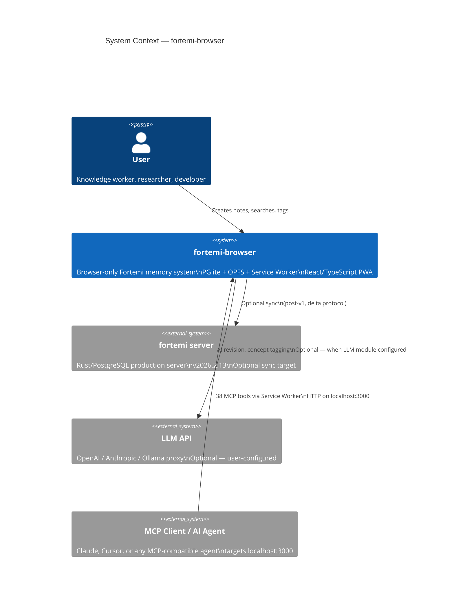
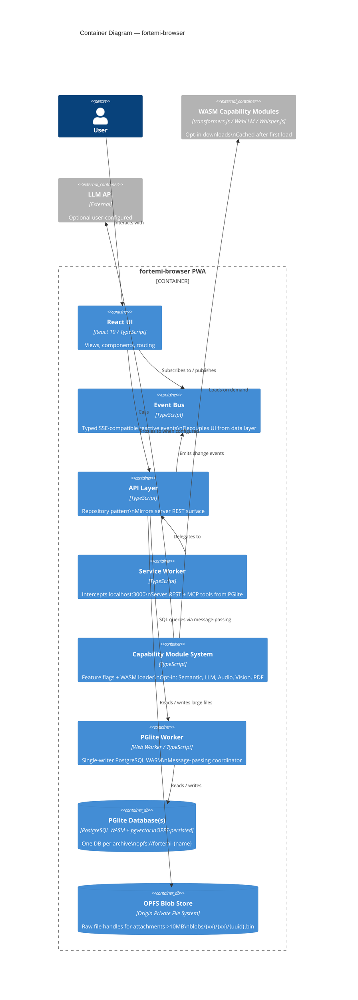
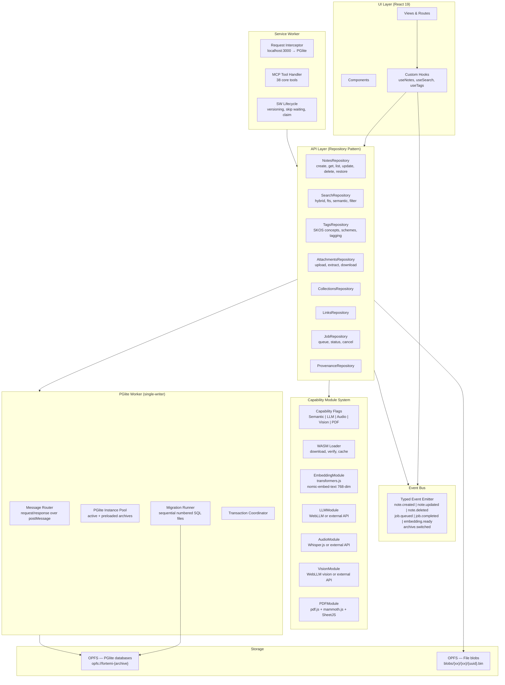
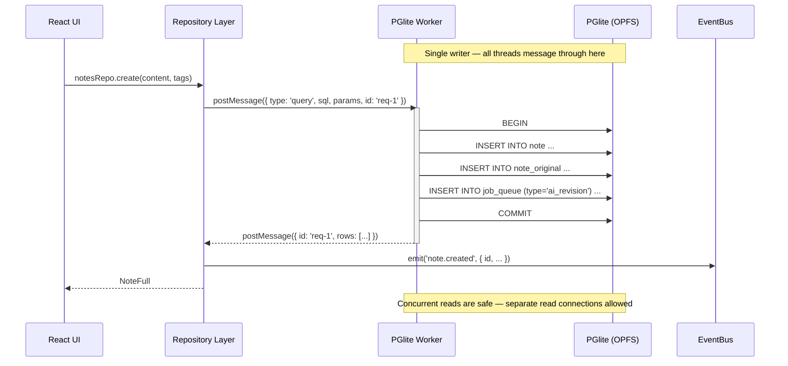
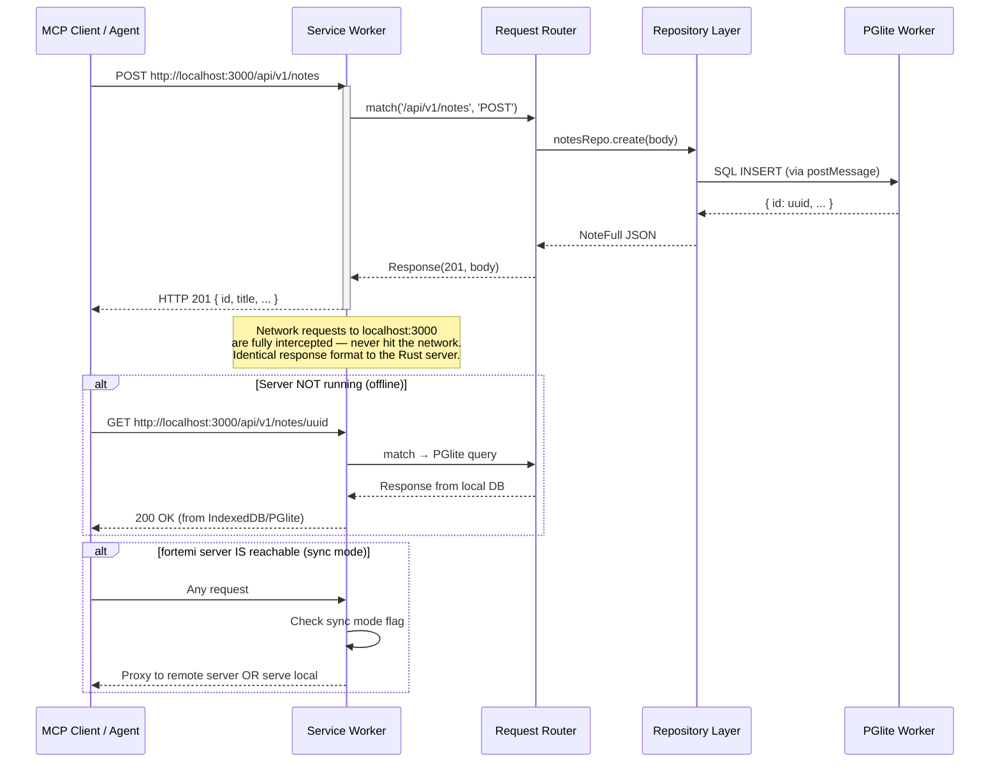
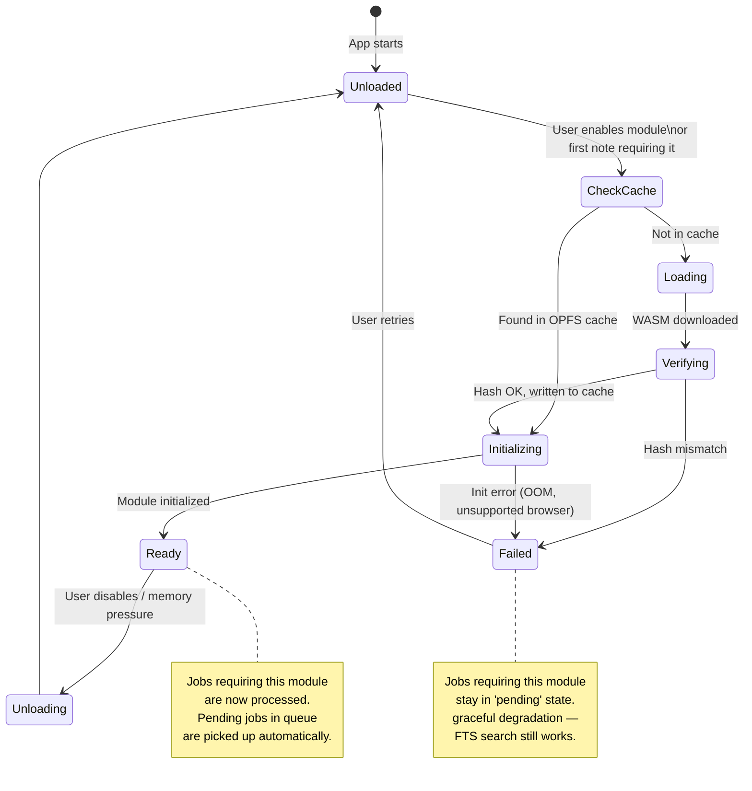
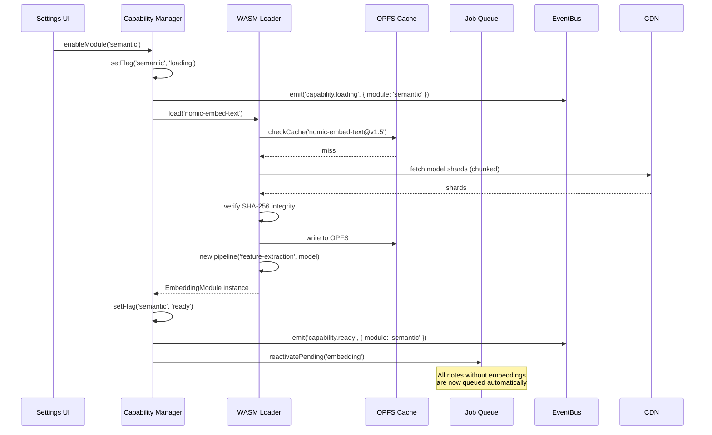
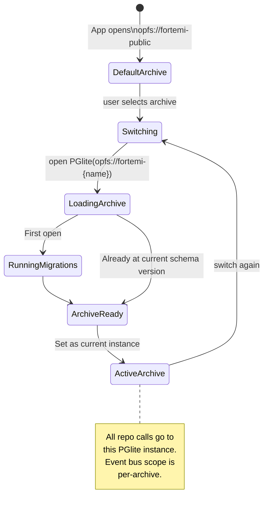
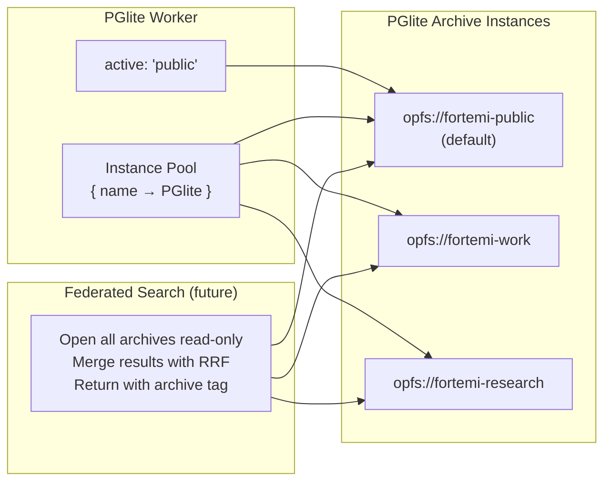

# Software Architecture Document — fortemi-browser

**Version**: 2026.3.0
**Status**: Approved (intake phase)

---

## 1. System Context

fortemi-browser is a browser-native reimplementation of the Fortemi intelligent memory server. It runs entirely client-side using PGlite (PostgreSQL WASM) for structured storage and OPFS for file blobs. A Service Worker intercepts HTTP requests on `localhost:3000`, making the browser backend indistinguishable from the server to MCP tools and external integrations.

---

## 2. Container Architecture

---

## 3. Layer Architecture

---

## 4. PGlite Single-Writer Pattern

PGlite does not support concurrent write connections. All writes are serialized through a dedicated Web Worker using message-passing.

---

## 5. Service Worker REST Interception

---

## 6. Capability Module Loading

---

## 7. Archive / Multi-Memory Switching

