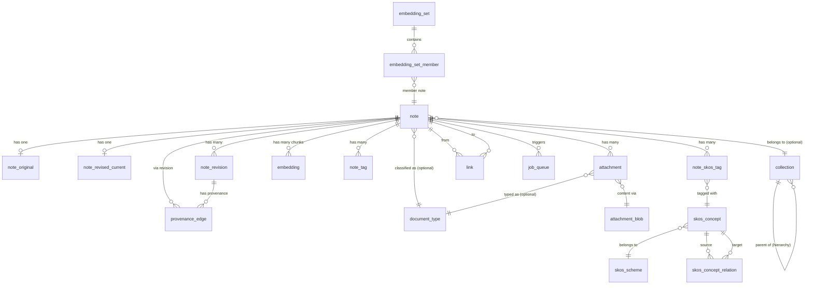
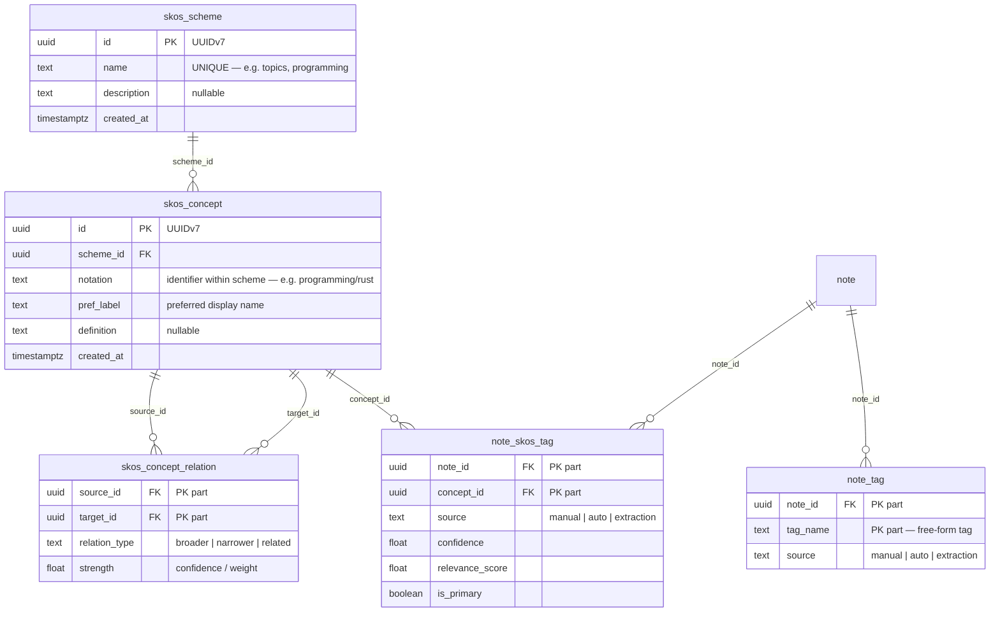
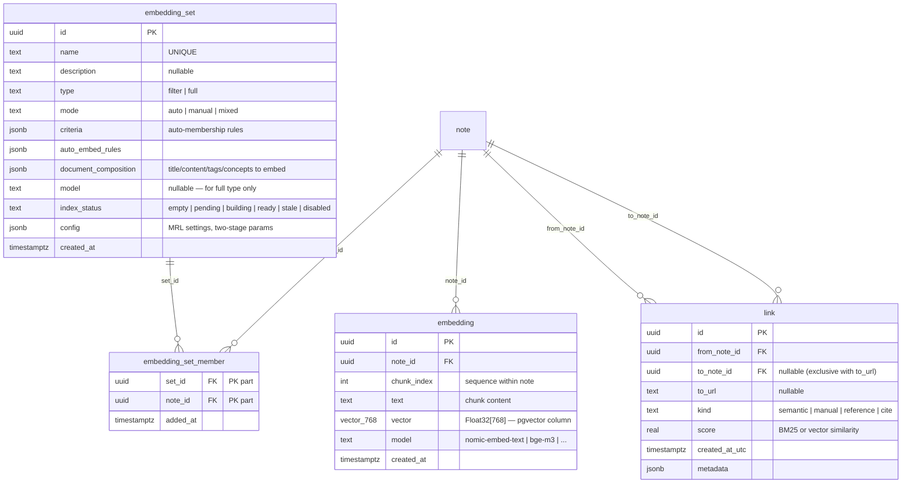
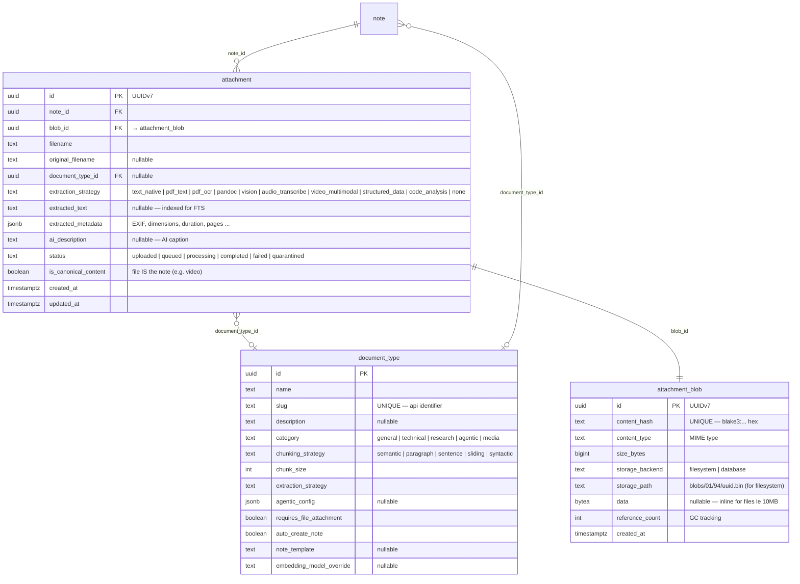
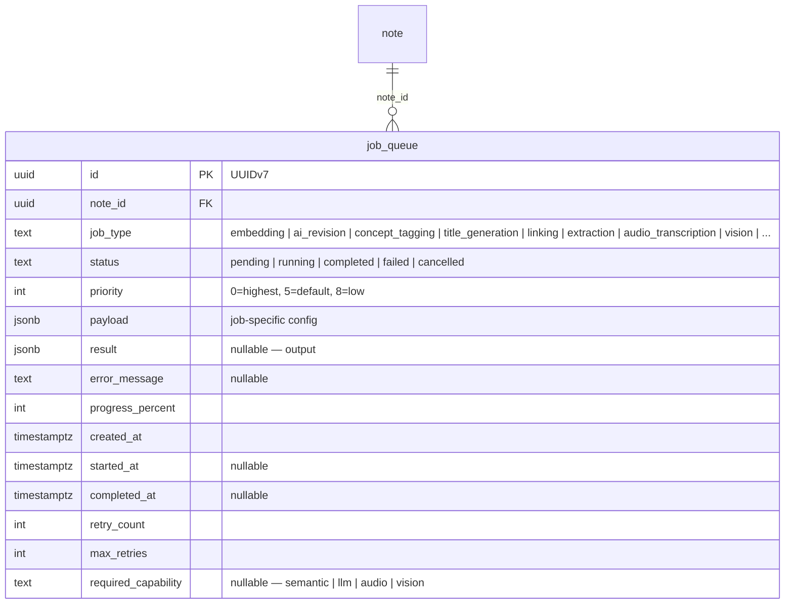
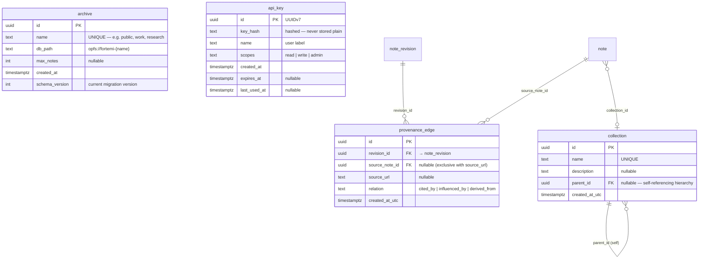

# Data Model — fortemi-browser

**Version**: 2026.3.0
**Reference**: fortemi server `matric-core/src/models.rs` + `migrations/`
**Storage**: PGlite (PostgreSQL WASM) — all types are native PostgreSQL

---

## 1. Full Entity Relationship Overview



---

## 2. Core Notes Model

```mermaid
erDiagram
    note {
        uuid id PK "UUIDv7"
        uuid collection_id FK "nullable"
        text format "markdown | plain | html"
        text source "user | api | email | import"
        timestamptz created_at_utc
        timestamptz updated_at_utc
        boolean starred
        boolean archived
        text title "nullable — AI generated or extracted"
        jsonb metadata "extensible key-value"
        uuid document_type_id FK "nullable"
        text visibility "private | shared | internal | public"
        timestamptz deleted_at "nullable — soft delete"
    }

    note_original {
        uuid note_id PK FK
        text content "immutable original user input"
        text hash "SHA-256 of content"
        timestamptz user_created_at "nullable"
        timestamptz user_last_edited_at "nullable"
    }

    note_revised_current {
        uuid note_id PK FK
        text content "AI-enhanced working version"
        uuid last_revision_id FK "nullable → note_revision"
        jsonb ai_metadata "model, confidence, params"
        timestamptz ai_generated_at "nullable"
        boolean is_user_edited
        int generation_count
        text model "nullable — e.g. llama3.2"
        tsvector tsv "GENERATED — FTS index on content"
    }

    note_revision {
        uuid id PK "UUIDv7"
        uuid note_id FK
        uuid parent_revision_id FK "nullable — chain"
        int revision_number
        text content
        text type "ai_enhancement | user_edit | ..."
        text summary "nullable"
        text rationale "nullable"
        timestamptz created_at_utc
        timestamptz ai_generated_at "nullable"
        boolean is_user_edited
        int generation_count
        text model "nullable"
    }

    note ||--|| note_original : "note_id"
    note ||--o| note_revised_current : "note_id"
    note ||--o{ note_revision : "note_id"
    note_revised_current }o--o| note_revision : "last_revision_id"
    note_revision }o--o| note_revision : "parent_revision_id (chain)"
```

---

## 3. SKOS Knowledge Graph



---

## 4. Search & Embeddings Model



**HNSW Index** (created in migration):
```sql
CREATE INDEX ON embedding USING hnsw (vector vector_cosine_ops)
WITH (m = 16, ef_construction = 64);
```

---

## 5. File Attachments Model



**Two-tier blob storage strategy:**
```
size_bytes <= 10MB  →  attachment_blob.data (BYTEA inline in PGlite)
size_bytes  > 10MB  →  attachment_blob.storage_path (raw OPFS file handle)
                        path: blobs/{first2ofUUID}/{next2ofUUID}/{uuid}.bin
```

---

## 6. Job Queue Model



**Priority assignments:**
```
TitleGeneration:     2   (fast, high value)
Linking:             3   (moderate cost)
Embedding:           5   (default)
ConceptTagging:      5   (chains from AiRevision)
MetadataExtraction:  5
AiRevision:          8   (expensive, lower priority)
```

---

## 7. Provenance & Access Control



---

## 8. Complete Table Inventory

| Table | Purpose | Key columns |
|---|---|---|
| `note` | Core note metadata | id (UUIDv7), format, source, visibility, deleted_at |
| `note_original` | Immutable original content | note_id (PK/FK), content, hash |
| `note_revised_current` | AI-enhanced working copy | note_id (PK/FK), content, tsv (GENERATED) |
| `note_revision` | Version history chain | id, note_id, parent_revision_id, revision_number |
| `attachment` | File metadata | id, note_id, blob_id, extraction_strategy, status |
| `attachment_blob` | Content-addressable file store | id, content_hash (UNIQUE), storage_backend, data |
| `embedding` | Vector chunks | id, note_id, chunk_index, vector(768), model |
| `embedding_set` | Named search collections | id, name, type (filter/full), mode, index_status |
| `embedding_set_member` | Set membership | set_id, note_id |
| `skos_scheme` | Tag namespace | id, name |
| `skos_concept` | Hierarchical tag | id, scheme_id, notation, pref_label |
| `skos_concept_relation` | Broader/narrower/related | source_id, target_id, relation_type, strength |
| `note_tag` | Free-form tags | note_id, tag_name, source |
| `note_skos_tag` | SKOS concept tags | note_id, concept_id, confidence, is_primary |
| `link` | Note-to-note connections | id, from_note_id, to_note_id, kind, score |
| `provenance_edge` | W3C PROV derivation | id, revision_id, source_note_id, relation |
| `collection` | Folder hierarchy | id, name, parent_id (self-ref) |
| `archive` | Memory isolation registry | id, name, db_path, schema_version |
| `job_queue` | Async processing pipeline | id, note_id, job_type, status, priority |
| `document_type` | Content type catalog | id, slug, extraction_strategy (seeded) |
| `api_key` | API authentication | id, key_hash, scopes, expires_at |
