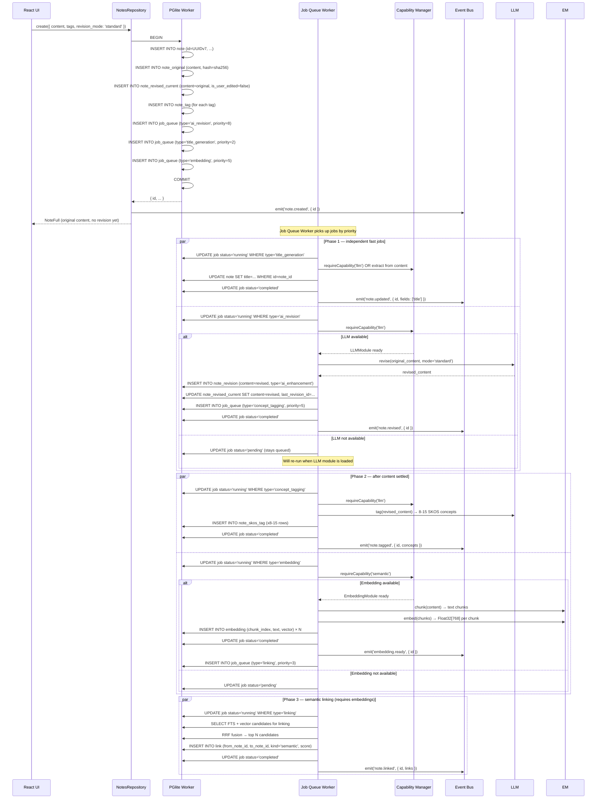
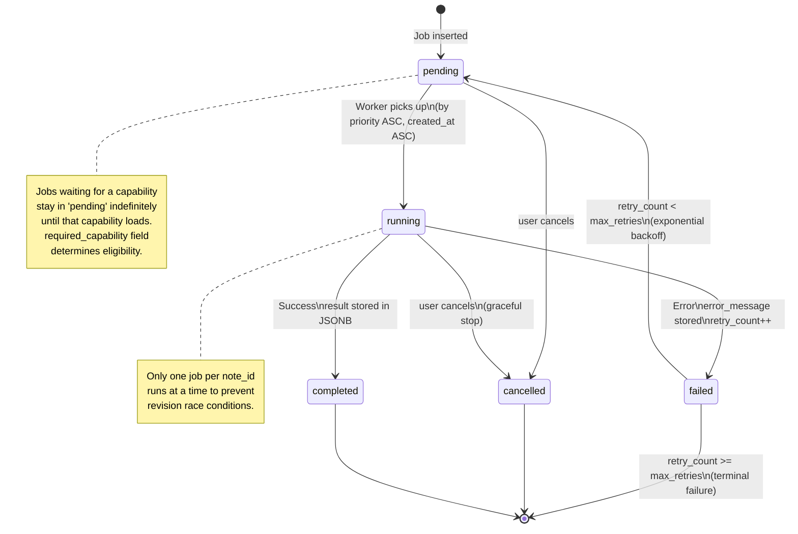
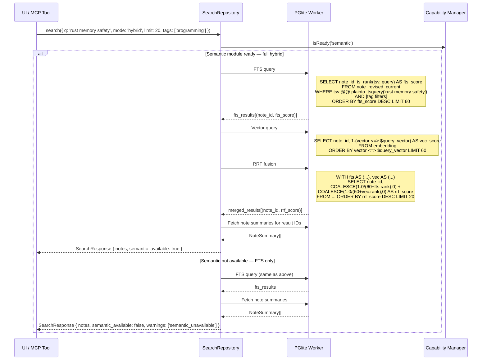
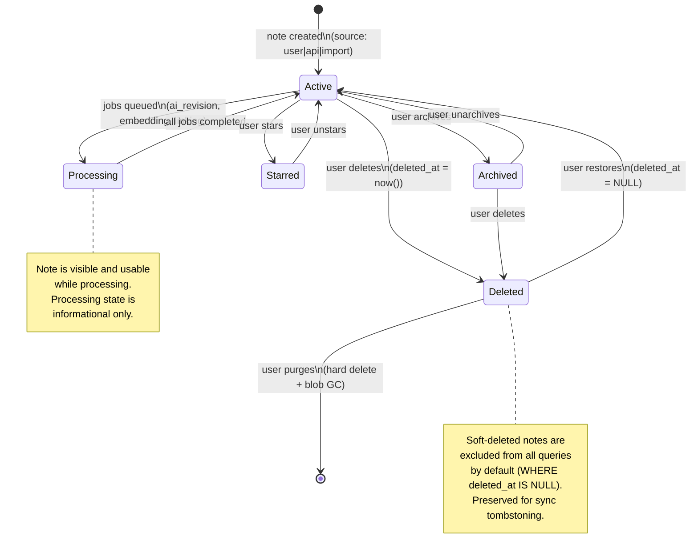
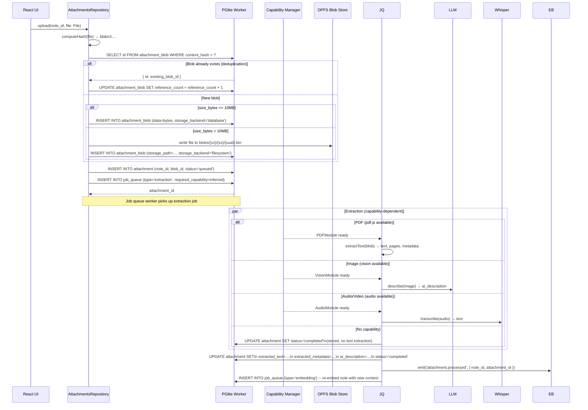
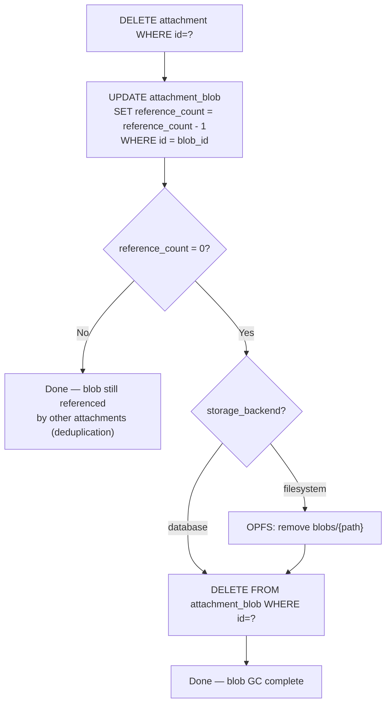
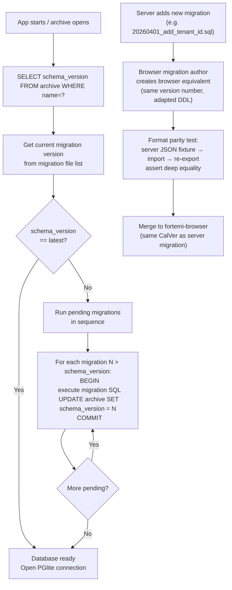
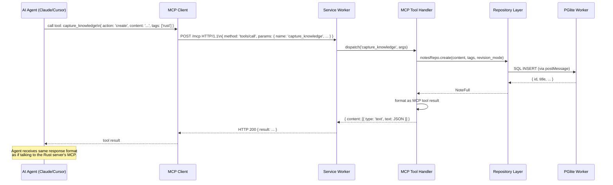
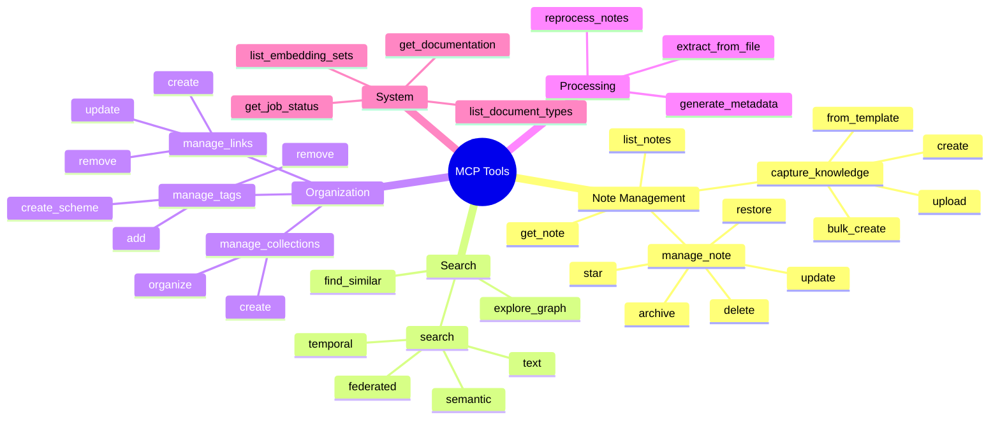

# Flows, Sequences & State Machines — fortemi-browser

**Version**: 2026.3.0

---

## 1. Note Creation Pipeline

The full pipeline from user input to a fully-processed note with embeddings, AI revision, concept tags, and links.



---

## 2. Job Queue State Machine



---

## 3. Hybrid Search Flow



---

## 4. Note Lifecycle State Machine



---

## 5. Attachment Processing Pipeline



---

## 6. Attachment Blob GC (Reference Counting)



---

## 7. Migration Strategy Flow



**Browser migration file naming convention:**
```
migrations/
  0001_initial_schema.sql          ← adapted from server migration 20260102
  0002_skos_tagging.sql            ← adapted from server migration 20260118
  0003_attachments.sql             ← adapted from server migration 20260203
  0004_embedding_sets.sql          ← adapted from server migration 20260117
  0005_multi_memory.sql            ← adapted from server migration 20260201
  ...
```

**What gets adapted (not simply copied):**
- Remove: `CREATE ROLE`, `GRANT`, tablespaces, publications (not supported in PGlite)
- Remove: server-specific PostgreSQL extensions not in PGlite (e.g., `pg_partman`)
- Keep: `CREATE TABLE`, `ALTER TABLE`, `CREATE INDEX`, `pgvector` extension, `tsvector GENERATED`
- Add: `CREATE INDEX` hints tuned for PGlite HNSW performance (may differ from server)

---

## 8. MCP Tool Request Flow



**38 Core MCP Tools — Browser implementation scope:**


