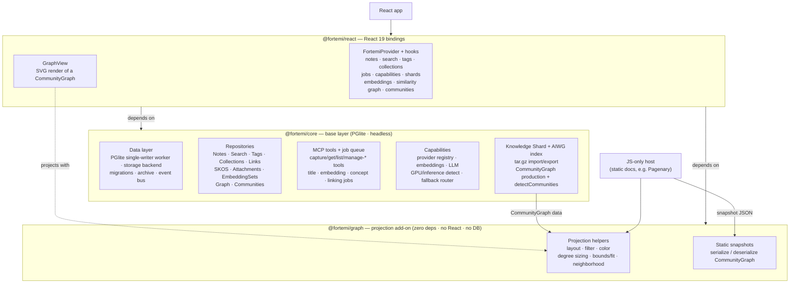

# Package Architecture

fortemi-react ships three published npm packages plus a private demo app. They
form a strict layering: `@fortemi/core` is the base and depends on nothing in the
workspace; `@fortemi/graph` is a zero-dependency add-on; `@fortemi/react` binds
both to React. Dependency arrows only ever point *up* the stack — **core never
depends on graph or react, and graph never depends on core or react.**

## Capabilities by package

The diagram is intentionally summarized; the tables below enumerate the full
surface of each package.

### `@fortemi/core` — headless base layer

| Capability | What it provides |
|---|---|
| Data layer | PGlite (PostgreSQL WASM) with a single-writer worker, tiered persistence (OPFS / IndexedDB / in-memory), storage backends, numbered migrations, archive manager, typed event bus |
| Repositories | Notes, Search (text/semantic/hybrid + RRF), Tags, Collections, Links, SKOS, Attachments, EmbeddingSets, **Graph** (similarity/link graph production + `detectCommunities`), Communities |
| MCP tools | `captureKnowledge`, `getNote`, `listNotes`, `manageNote`, `manageTags`, `manageCollections`, `manageLinks`, `manageArchive`, `manageCapabilities`, `manageAttachments`, `search` + `fortemiManifest` |
| Job queue | Server-compatible pipeline: ai_revision → title → embedding → concept tagging → linking |
| Capabilities | Provider registry, OpenAI-compatible provider, fallback router, local discovery, embeddings/LLM handlers, GPU + inference tier detection |
| Interchange | Knowledge Shard tar.gz import/export with checksums and conflict strategies; AIWG index loader + `aiwgFortemiIndexToCommunityGraph` |
| Runtime | PGlite worker entry, service-worker REST interception, plugin content-security helpers |

### `@fortemi/graph` — graph projection add-on

| Capability | Helpers |
|---|---|
| Layout | `layoutCommunityGraph` (deterministic `force` / `radial` / `community` / `manual`) |
| Filter | `filterCommunityGraph` (community / edge kind / node allow-list / predicate) |
| Sizing | `computeDegrees`, `nodeRadius` |
| Color | `colorForCommunity`, `COMMUNITY_COLORS` |
| Bounds / fit | `computeGraphBounds`, `fitGraphToViewport` |
| Neighborhood | `buildAdjacency`, `neighborsOf`, `expandNeighborhood`, `subgraphForNodes`, `neighborhoodSubgraph` |
| Snapshots | `serializeGraphSnapshot`, `stringifyGraphSnapshot`, `deserializeGraphSnapshot` |

Zero runtime dependencies. Pure and deterministic. Operates on plain
`CommunityGraph` data, so a graph from `@fortemi/core` (or any compatible source)
drops straight in. Community *detection* stays in `@fortemi/core`; this package
only *projects* graphs it is given.

### `@fortemi/react` — React 19 bindings

| Capability | What it provides |
|---|---|
| Provider | `FortemiProvider` (db, events, archive, capabilities, blob store; worker-mode support) + `useFortemiContext` |
| Hooks | Notes, search (+ history/suggestions), tags, collections, job queue, related notes, concepts, provenance, shard import/export, GPU/inference capabilities, local discovery, embedding pipeline, embedding sets, similarity graph, communities, graph controller, AIWG index, capability setup |
| Components | `GraphView` — renders a `CommunityGraph` to SVG using `@fortemi/graph` |

## Why this layering

- **Core stays minimal and reusable.** Anything that needs the database lives in
  core; nothing forces a core consumer to adopt React or the graph helpers.
- **Graph is shareable and mixable.** Because it has no dependencies and renders
  plain `CommunityGraph` data, a static documentation site can render an AIWG
  relationship graph from a precomputed snapshot without React or PGlite (see
  `packages/graph/README.md` for a vanilla-JS example).
- **React composes both** into hooks and a `GraphView` component, staying
  visually aligned with JS-only hosts because they share the same projection code.
